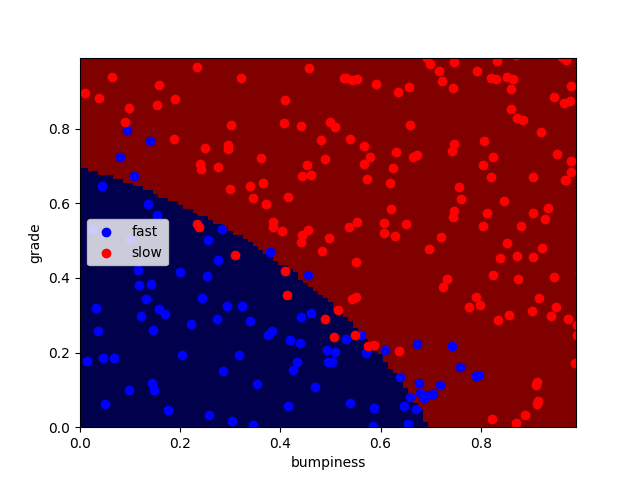
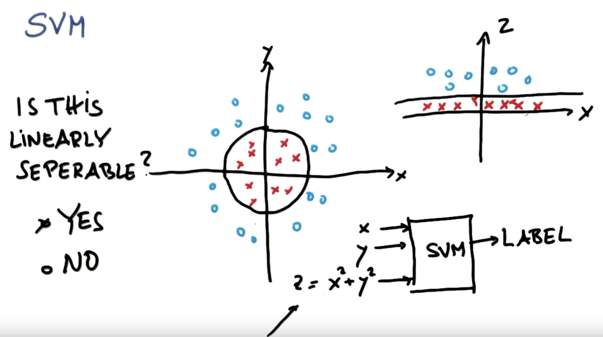
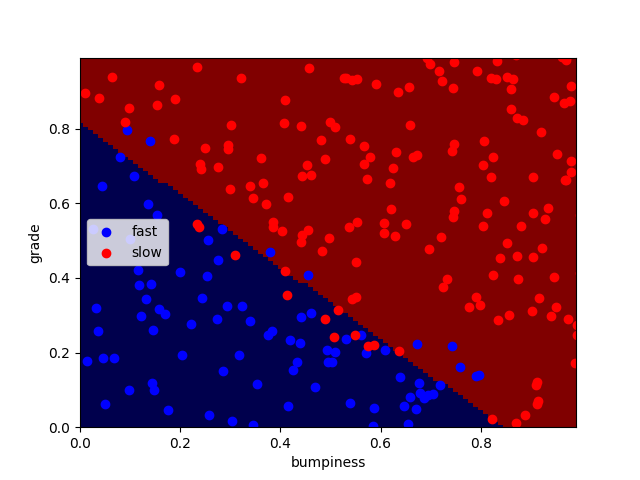
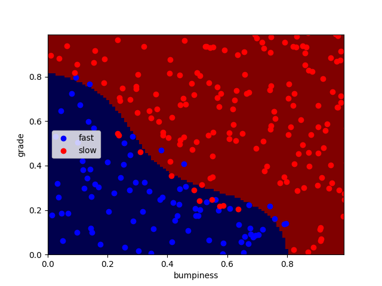
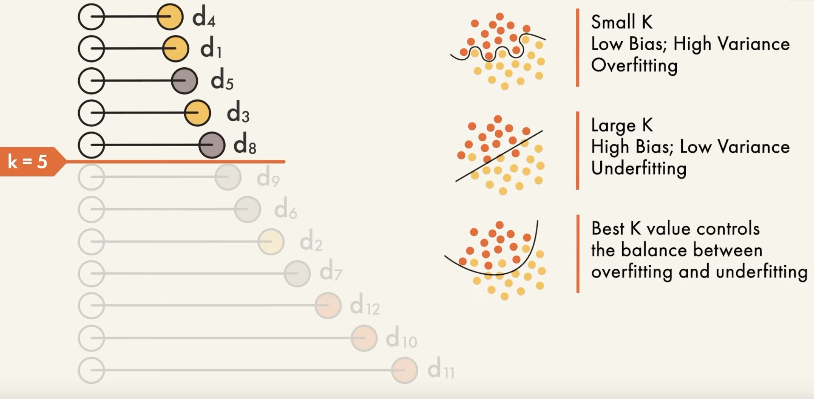
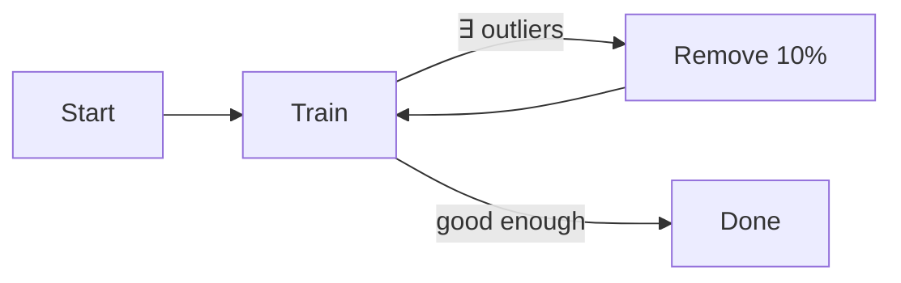

# machine learning

```
make .venv
```

## Resources

Thank you to the following resources and people:

- [Udacity UD120 with Sebastian Thrun and Katie Malone](https://www.youtube.com/watch?v=ICKBWIkfeJ8&list=PLAwxTw4SYaPkQXg8TkVdIvYv4HfLG7SiH)
- [StatQuest with Josh Starmer](https://www.youtube.com/@statquest)
- The Elements of Statistical Learning
- [scikit learn folks](https://scikit-learn.org/stable/about.html#authors)

## Notes

**Supervised learning** is when you performs classifications on a dataset that already has labeled examples.

Examples:

- Given a user's music choices, predict whether they like or dislike a new song based on features of a song.
- From an album of tagged photos, recognize someone in a photo.

Non-examples:

- Analyze bank data for weird-looking transactions.
- Cluster students in a course based on learning preferences.

## Scatter plots

**Decision Surface** in a scatter plot is the boundary between multiple classes of data.

ML algorithms define a decision surface which helps disambiguate data that fall in the "unclear" region.

## Naive Bayes

Example:

P(C) = probability of having cancer

P(C) = 0.01

90% it is positive if you have C <-- sensitivity

90% it is negative if you don't have C <-- specificity

**Given that you test positive**, what is the probability that you have cancer? (It's about 8.33%)

```
(Prior probability) * (evidence) = (posterior probability)

Priors
P(C)      = 0.01
P(¬C)     = 0.99
P(pos|C)  = 0.90 <-- sensitivity
P(neg|¬C) = 0.90 <-- specificity
P(neg|C)  = 0.10
P(pos|¬C) = 0.10

Joint
P(C, pos)  = P(C)  • P(pos|C)  = 0.009
P(¬C, pos) = P(¬C) • P(pos|¬C) = 0.099

Normalizer
P(pos) = P(C, pos) + P(¬C, pos) = 0.108

Posterior
P(C|pos)  = P(pos|C)  * P(C)  / P(pos) = 0.0833
P(¬C|pos) = P(pos|¬C) * P(¬C) / P(pos) = 0.9167
```

Eaxmple of classifying whether a car should go slow or fast based on the grade and bumpiness of the road:



- The background represents the trained model, and the scatterplot in the foreground represents the test data.

## Support Vector Machines (SVM)

- "machine" == "algorithm"
- defines a decision boundary AKA "hyperplane"
- **margin** is the distance between the hyperplane and the closest data point
- a good hyperplane is one that maximizes the margin
- sometimes the data is not linearly separable, so we can use a **kernel trick** to transform the data into a higher dimension



- VSM parameters include the kernel type, C, and gamma
  - C controls the tradeoff between **smooth decision boundary** and **classifying training points correctly** (high C = low margin)
  - gamma defines how far the influence of a single training example reaches (low gamma = far reach)
- VSM parameters can be adjusted to prevent **overfitting**

This is the same example as before but with different kernel parameters:

Linear:


RBF (may be prone to overfitting):



## Decision Trees

- **entropy** controls how a DT decides where to split the data
- entropy is a measure of **impurity** in a bunch of examples

<!-- prettier-ignore -->
$$ H(x) = -\sum_{i=1}^n p(x_i) \log_2 p(x_i) $$

```
information gain = entropy before split - weighted average of entropy after split
```

> Trees have one aspect that prevent them from being the ideal tool for predictive learning, namely inaccuracy.

## K-Nearest Neighbors



## Empirical comparison of classification algorithms

Enron email classification result:

| strategy            | accuracy |
| ------------------- | -------- |
| naive bayes         | 0.9733   |
| svm                 | 0.9960   |
| decision trees      | 0.9778   |
| k-nearest neighbors | 0.9795   |
| ada boost           | 0.9505   |
| random forest       | 0.9966   |

## Continuous Supervised Learning

- Up until now in this course, we've been dealing with classification problems in which the output is a **discrete** value.
- **regression** is a supervised learning algorithm that predicts a continuous value
- We want to minimize the sum of the squared errors (SSE) between the predicted and actual values
- 2 algorithms for minimizing SSE:
  - **ordinary least squares** is a closed-form solution that finds the best fit line
  - **gradient descent** is an iterative algorithm that starts with a random guess and iterates until it finds the best fit
- Beware: One short coming of SSE is that as you inspect more data, the SSE will almost always increase simply by virtue of having more data points. This is why we use **R-squared** to measure the fitness of a regression line.
- [**R-squared**](https://www.youtube.com/watch?v=bMccdk8EdGo) is a measure of how well the regression line fits the data (1 = perfect fit, 0 = no fit)

## Comparing Supervised Classification & Supervised Regression

- Aspects of the Regression technique often have analogues in the Classification technique, and vice versa.

| Property           | Classification    | Regression    |
| ------------------ | ----------------- | ------------- |
| Output             | Discrete          | Continuous    |
| Result of training | Decision boundary | Best fit line |
| Evaluation metric  | Accuracy          | R-squared     |

## Multivariate Regression

- **multivariate regression** is a regression technique that uses more than one feature to predict a continuous value

## Outliers

### Outlier Rejection



## Unsupervised Learning

- **Unsupervised Learning** finds patterns in data that are not labeled, classified, or categorized.
- **Clustering** is a technique that groups similar data points together
- **Dimensionality Reduction** is ...

## K-Means Clustering

https://www.naftaliharris.com/blog/visualizing-k-means-clustering/

2 Steps:

1. **Assign** each data point to the cluster center that is closest to it
2. **Optimize** by minimizing the quadratic distance between each data point and its cluster center

## Feature Scaling

- **Feature Scaling** is a technique that transforms the values of numeric features so that they have similar ranges
- Example of scaling to `[0,1]`:

<!-- prettier-ignore -->
$$ x' = \frac{x - x_{min}}{x_{max} - x_{min}}   $$

<!-- prettier-ignore -->
$$ 0 \le x' \le 1 $$

- Algorithms in which two dimensions affect the outcome will be affected by rescaling.

| Algo              | Featuring Scaling influences the result? |
| ----------------- | ---------------------------------------- |
| Decision Trees    |                                          |
| SVM w/ RBF kernel | ✓                                        |
| Linear Regression |                                          |
| K-Means           | ✓                                        |

## Feature Selection

1. select a subset of features that yield the most discriminative power when it comes to classifying the data
2. consider adding new features derived from existing features

## Bias-Variance Dilemma and Number of Features
